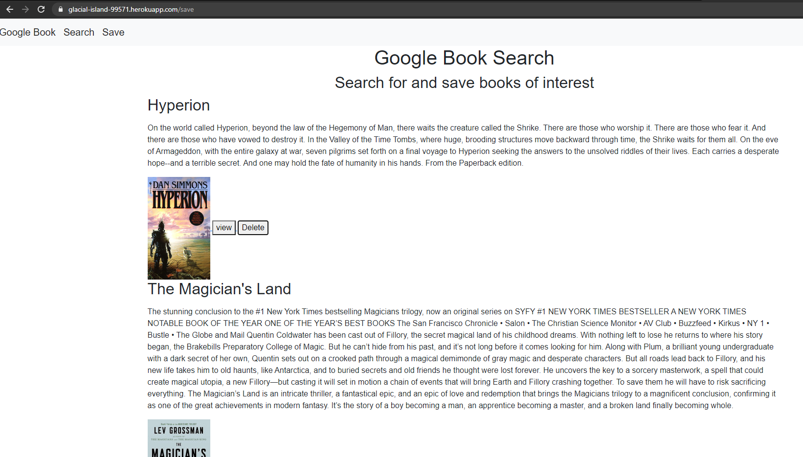

# Google Books

## Description
This application uses the googlebooks api and a mongodb database stored using AtlasDB to allow a user to search for books and save them to a persistent database for future reference.

## Built With

* [HTML](https://developer.mozilla.org/en-US/docs/Web/HTML)
* [CSS](https://developer.mozilla.org/en-US/docs/Web/CSS)
* [JS](https://www.javascript.com/)
* [GitHub](https://github.com/)
* [Git](https://git-scm.com/)
* [node.js](https://nodejs.org/en/)
* [npm](https://www.npmjs.com/)
* [Reactjs](https://reactjs.org/)
* [Bootstrap](https://getbootstrap.com/)
* [MongoDB](https://www.mongodb.com/)
* [AtlasDB](https://www.mongodb.com/cloud/atlas)
* [Heroku](https://dashboard.heroku.com/apps)

## Deployed Link

* [See Live Site](https://glacial-island-99571.herokuapp.com/)

## Preview of Working Site



## Code Snippet
This code is used in the search page to make calls from the client side to search for books using the google api. It also shows the function that is passed as a prop to the component that shows data for the searched books and allows a user to save books.

```javascript
  const [books, setBooks] = useState([]);
  const [search, setSearch] = useState("");
  const [result, setResult] = useState({});
  function loadBooks(event) {
    event.preventDefault();
    // console.log("loadedbooks")
    var searchName = event.target.value;
    if (searchName === "") {
      setBooks([]);
    }

    API.getBookList().then(() => {
      API.getBooks(searchName).then((books) => {
        setBooks(books)
      });
    })
      .catch(err => console.log(err));
  }

  function saveBooks(bookData) {
    console.log(bookData);
    API.saveBook({
      title: bookData.title,
      author: bookData.author,
      synopsis: bookData.synopsis,
      image: bookData.image,
      link: bookData.link
    })
      .catch(err => console.log(err))
  }
```

## Authors

* **Raffi Lepejian** 

## Contact Information

- [Link to Portfolio Site](https://rslepejian.github.io/react-portfolio/#/)
- [Link to Github](https://github.com/rslepejian)
- [Link to LinkedIn](https://linkedin.com/in/raffi-lepejian-071876153)